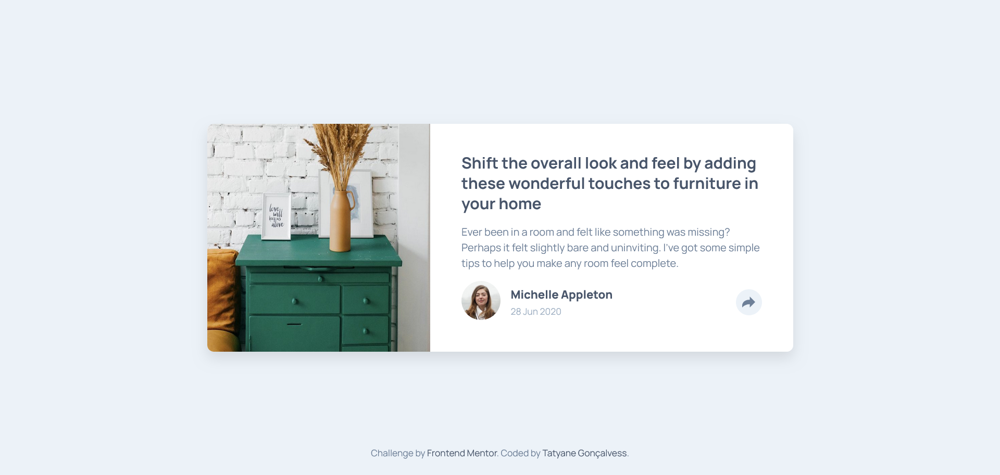
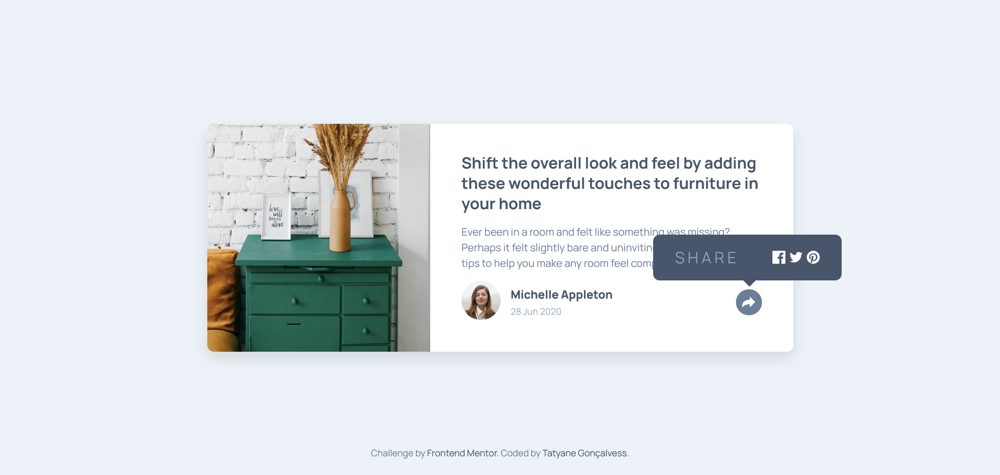
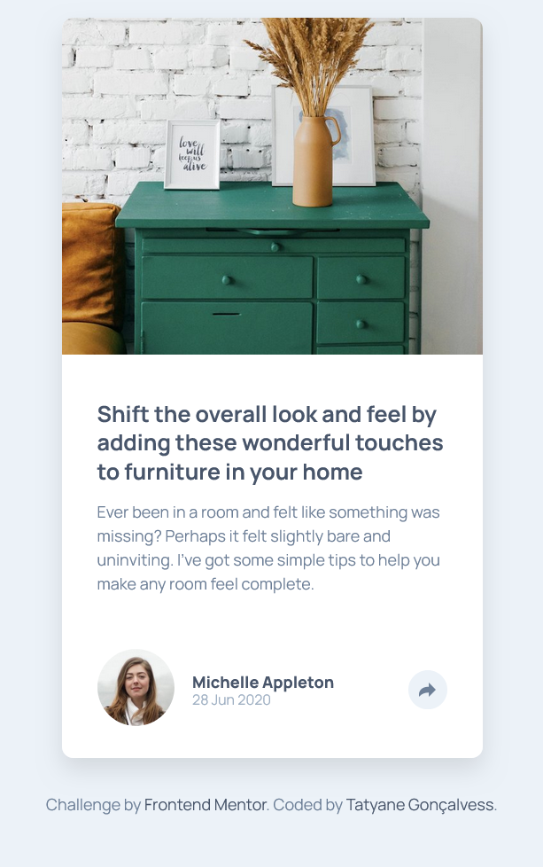
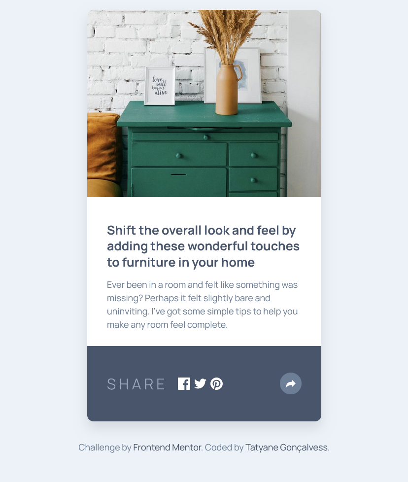

<h1 align="center"> Artigo 📝</h1>

<p align="center">
  <a href="#-tecnologias">Tecnologias</a>&nbsp;&nbsp;&nbsp;|&nbsp;&nbsp;&nbsp;
  <a href="#-projeto">Projeto</a>&nbsp;&nbsp;&nbsp;|&nbsp;&nbsp;&nbsp;
  <a href="#-licenca">Licença</a>&nbsp;&nbsp;&nbsp;|&nbsp;&nbsp;&nbsp;
</p>



## 🔥 Introdução
Esse projeto é uma página de artigo feita com **HTML**, **SCSS** e **JavaScript**. A missão foi simples: praticar o que venho aprendendo na marra, escrevendo código de verdade. Nada melhor do que um bom desafio do **Frontend Mentor** para sair da zona de conforto e evoluir no front-end. 😎


### ✨ O que foi feito
- Estrutura semântica com HTML
- Estilo com SCSS
- Uma pitada de interatividade com JS
- Responsividade para funcionar bonito em qualquer tela

Tudo feito com foco em melhorar as habilidades e entender como as peças se encaixam num projeto de front-end de verdade.

Desafio proposto pelo [Frontend Mentor](https://www.frontendmentor.io/home), mas com meu toque pessoal. 🚀

## 🛠️ Tecnologias usadas
Esse projeto foi desenvolvido com as seguintes tecnologias:

- HTML5
- SCSS (Sass)
- JavaScript Vanilla (puro mesmo, sem framework ou biblioteca)
- Git + VS Code

## 🚀 Como rodar o projeto
1 - Clone o repositório
```bash
git clone https://github.com/tatyanepgoncalves/article
```

2 - Acessa a pasta do projeto
```bash
cd article
```
3 - Abra o arquivo `index.html` no navegador
(pode só dar dois cliques, ou usar uma extensão tipo `Live Server` no VS Code)

Pronto, tá rodando! 🎉 


## 💻 Projeto


- [Link do Repositório](https://github.com/tatyanepgoncalves/article)
- [Link da demostração](https://article-self-three.vercel.app/)





## 📌 Observações
Esse projeto faz parte do meu processo de aprendizado. Então se você viu algo que pode melhorar, manda ver! Feedback é sempre bem-vindo. 💬


Feito com ❤️ por [Tatyane Gonçalves](https://github.com/tatyanepgoncalves)
